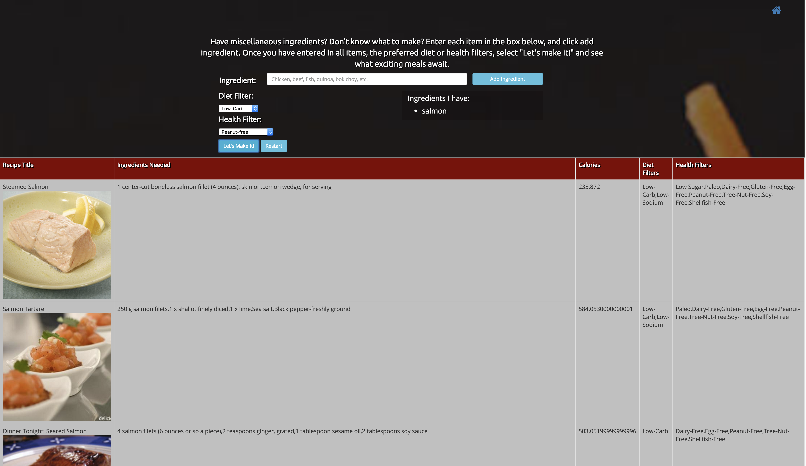

# Welcome to Recipe Finder! 

Recipe Finder is a project that demonstrates the utilization of API queries with data visualization. In this case the API requests information from the developer Edamam.com endpoint, selected by a user generated search, diet preference, and health preference. The request returns a data object, which is then parsed and displayed in a table for the user to view with links to each recipe. You can try the demo [here](https://navkelley.github.io/recipeFinder/). 

### Prerequisites

The Edamam API currently does not support JSONP for security reasons. Therefore, each user currently needs a CORS extension installed within their browser. Google Chrome has an excellent CORS extension that can be enabled or disabled at user discretion. The extension can be found here: [CORS extension](https://chrome.google.com/webstore/detail/allow-control-allow-origi/nlfbmbojpeacfghkpbjhddihlkkiljbi?hl=en)

## Built With

* Sublime Text 3
* Google Developer Tools

##Screen Shot Examples 

## Authors

**Nicole Kelley**--[navkelley](https://github.com/navkelley)

See also the list of [contributors](https://github.com/navkelley/recipeFinder/graphs/contributors) who participated in this project.

## Acknowledgments

* Special thanks to [Edamam](https://developer.edamam.com/) for providing the API
* My mentor [Patrick Ford](https://github.com/patrickford) for assisting me in debugging and implementation 
* My husband for being a test audience 
